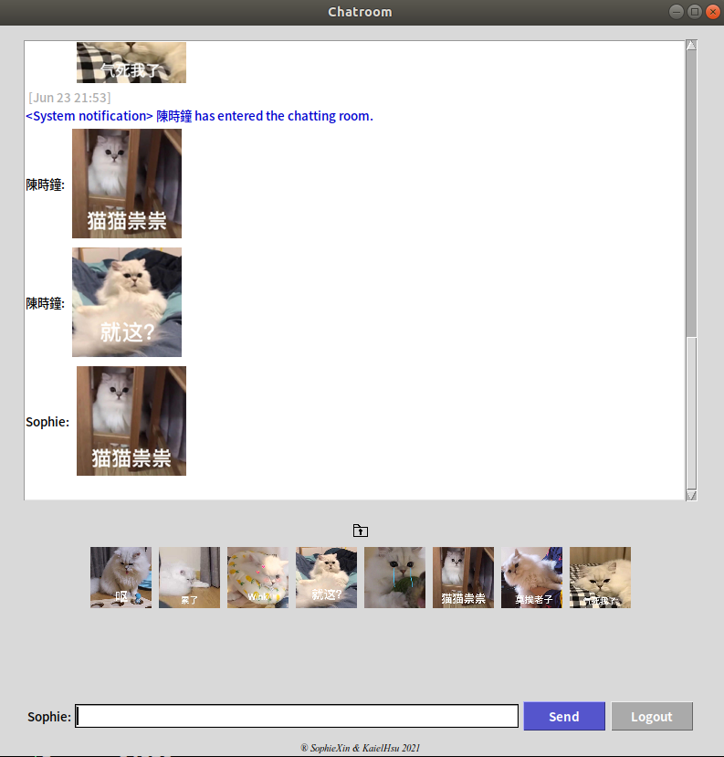

# Open Chatting Room

Network Application Programming <br>
網路應用程式設計 Final project

## Co-collaborator 共同協作者

B063040059 資工系110級 陳縵欣 SophieXin <br>
B064011007 資工系110級 徐筱媛 KaielHsu


## System Architecture
本專案使用的架構為 Client-Server 架構，有多個 client 端與兩個 Server 端，兩個 Server 各司其職，一個為 TCP Server，一個為 UDP Server，其系統架構圖如下：


### Client: Users
* Number of users: one user to multiple users (unlimited)
* UI Introduction
    * module: *tkinter*
    * main objects used: *Frame*, *ScrolledText*, *Entry*, *Button* etc.
    * structure
        * top: display chatting/sharing history, including image, emoji display
        * middle
            * part1: select file for sharing
            * part2: built-in emoji
        * bottom: user input field, logout button
* interaction flow: window is cleared by using *pack_forget()* function before entering the next phase
	* login
	* chatting
	* logout
		client's logout action: click logout button
* message: different font colors of different kind of messages
	* time: gray
	time will **only** display whenever receiving time is different from last message's
	* normal message: black
	* system message: blue
	* chat bot response: gray(for telling user to wait), pink(for the answer)
* programming histroy: some method we'd used before
    * *ScrollBar* and *ListBox*
    used to be applied in top frame, the main problem is that ListBox don't support image insertion, so *ScrolledText* replace them
    * *Text*
    used to be applied in bottom frame, but not so efficient, so *Entry* is used

### TCP Server: File System
* File receiving and sending (e.g. doc, pdf, txt, etc)
* Picture receiving and sending (e.g. jpg, png, gif, etc)
* Sound receiving and sending (e.g. mp3, wav, etc)
* Built-in emoji sharing
    while this function uses the *Button* objects, png is only applied


### UDP Server: Chatroom and chatbot
* Message receiving, sending and broadcasting
* Chat robot detects keywords and responses
    * Latest weather information
    * Real-time Google trend search top 10

## Usage
* User1
```
╭─ ~/Yourpath/client1
╰─ python3 client.py
```
* User2
```
╭─ ~/Yourpath/client2
╰─ python3 client.py
```
* User3
```
╭─ ~/Yourpath/client3
╰─ python3 client.py
```
* Server
```
╭─ ~/Yourpath/server
╰─ python3 tcp_server.py

╭─ ~/Yourpath/server
╰─ python3 udp_server.py
```

## Demo
[Demo 影片](https://www.youtube.com/watch?v=Zzy99qyFt9M)

### Client 端
* 一開始所執行的畫面


* 輸入 Sophie 之後


* 聊天室畫面


* 輸入天氣


* 輸入熱門搜尋


* 傳送貼圖


* 傳送檔案，其他 users 都會收到檔案


## Future Work
### Client GUI
* Music player
	*Pygame* seems to be a better choice, while *playsound* module doesn't support those files with any Chinese character(utf-8 coding needed) in file name.
